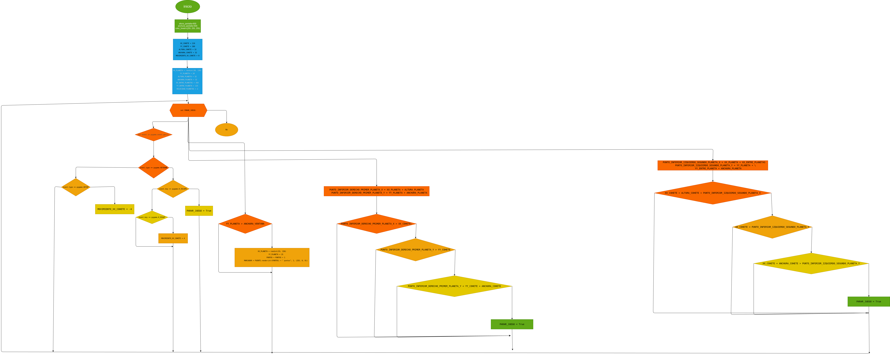

# Bimestral

## Hitboxes
 - la hitboxes de el planeta y del cohete, osea la caja de colision la cual al detectar una colision termina el juego.

 ## Variables
 - la variable o puntos es actualizada cada vez que un planeta llega al final de la 
 pantalla sumando un punto a la variable.
 
 ```puntos = 0 ```
 
 ```puntos = puntos + 1```

 ## Clones

 - el objeto planeta genera un clon al otro lado de la pantalla el cual tiene la misma funcion que el objeto base, la cual es aparecer y dirigirse hacia abajo de la pantalla.

 # Movimiento
 -  el movimiento el cual se utiliza para que los planetas se muevan hacia abajo y el movimiento del cohete el cual se utiliza para esquibar los planetas .

 # Tamaño
 - el tamaño es representado con dos datos: altura y anchura.

 ### Altura
 es representada por el eje "y".

 ### Anchura 
 es rrepresentada por el eje "x".

 # Timing
 - el timing es el tiempo que hay entre las rondas de planetas.

# spawm
- es la zona es la cual un objeto aparece, se define por dos datos el eje "y" y el eje "x".


# diagrama de flujo


